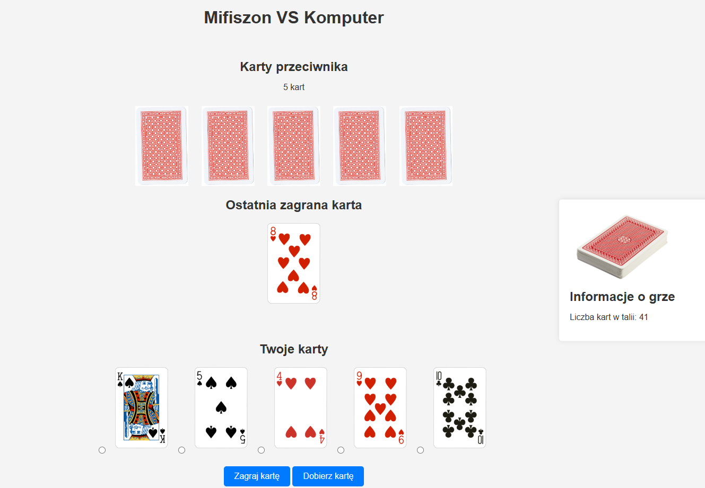
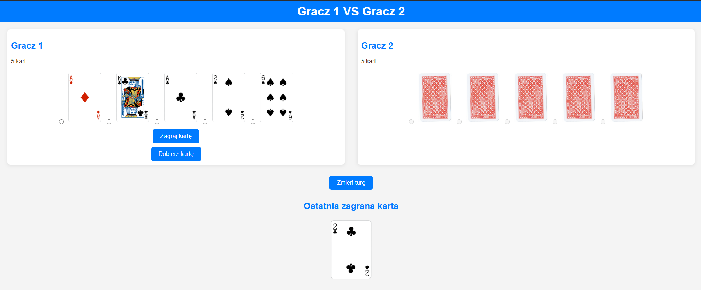
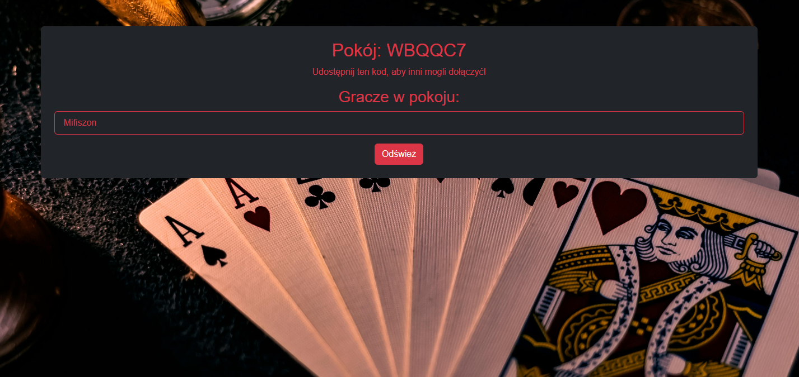
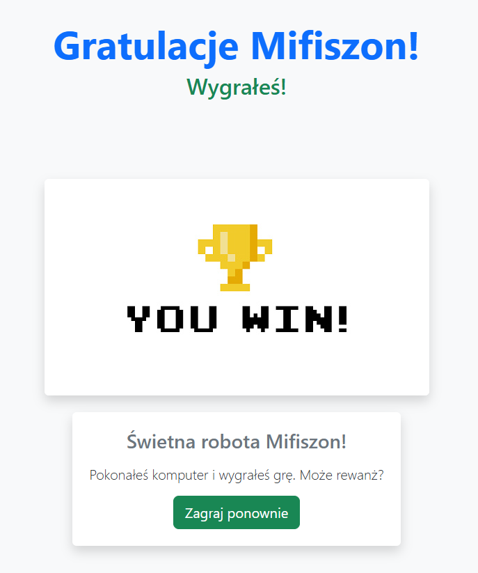

# 🃏 Makao - Django Card Game

This repository contains a **Makao card game** built using **Django**. The game offers multiple gameplay modes and rule sets, allowing players to enjoy a strategic and engaging experience.

> **The game is currently in development**, with some features still being implemented.

## 📖 Description

**Makao** is a popular card game similar to **Crazy Eights**, where players must get rid of all their cards by following specific rules. The game features different rule sets and modes to provide variety and challenge.

## 🎮 Gameplay

### 🏁 Starting the Game

1. Players begin by **entering their nickname**.
2. They select the **game mode**:
   - **🖥️ Single-player** – Play against AI.
   - **👥 Hot Seat** – Play locally with friends.
   - **🌐 Multiplayer** *(in development)* – Create or join a game room.
3. They choose the **rule set**:
   - **📜 Standard Rules** – Classic Makao gameplay.
   - **⚔️ War Mode** – Features additional strategic mechanics.
   - **⚙️ Custom Rules** *(to be implemented)* – Players can define their own rule sets.

### 🃏 Game Flow

- Players take turns **playing valid cards** based on the active rules.
- Special cards affect gameplay by forcing opponents to draw cards, skip turns, or change the suit.
- The game continues until a player has **no cards left**.

### 🎬 Game Over

After the game ends, a **win or lose screen** appears, displaying the final results.

## 🌐 Multiplayer Mode *(in development)*

- Currently, only **room creation** is implemented.
- More multiplayer features, including real-time gameplay, will be added in future updates.

## 📸 Screenshots

## 📌 Technologies Used

- **Django** – Backend framework.
- **AJAX** *(planned)* – For real-time multiplayer.
- **HTML/CSS/JavaScript** – Frontend.

## 🚀 Future Plans

- ✅ Implement **custom rule sets**.
- ✅ Expand **multiplayer functionality**.
- ✅ Improve **AI opponents**.

## 👨‍💻 Authors

- **Michał Ogiba**

## 📚 Sources

(https://en.wikipedia.org/wiki/Macau_(card_game))

---

**🛠️ Built with Django**

